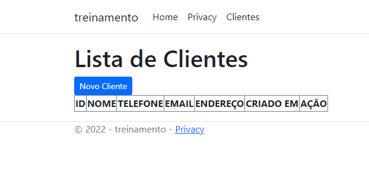

# Webapp: Projeto aspnet simples

### Modelo de site feito em aspnet usando sql para realizar conexões e interações no banco de dados. Atividade feita como forma avaliativa.

    FEITO POR https://github.com/LucasATS

## __📂 PLAY__
> gitclone: https://github.com/LucasATS/webapp.git

> dotnet run

## __🛠 TECNOLOGIAS__ 

## __😘 CONTATO__

  
  
  
   
    

